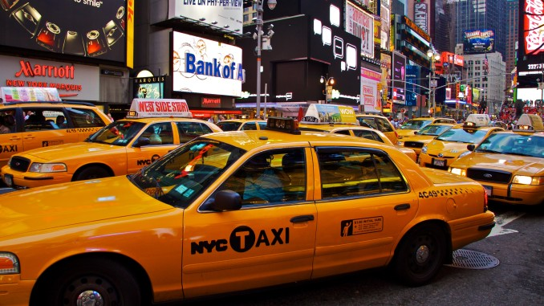

## New York City Yellow Cab

### What can we learn from 45 GB of New York City yellow cab data?
The purpose of this analysis is to explore the yellow cab data set to see what we can learn about the business. Also, to look for taxi cab drivers that cheats their customers by taking them on a sub-optimal route to their destination.

