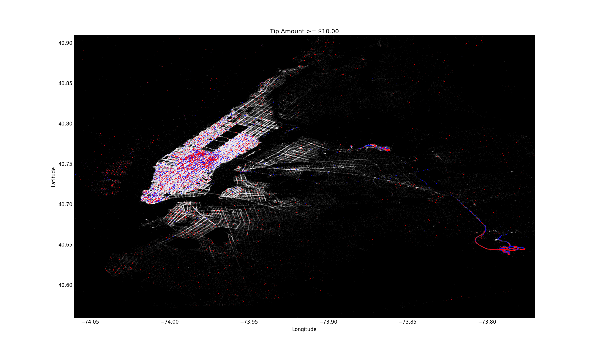

## New York City Yellow Cab

### What can we learn from 45 GB of New York City yellow cab data?
The purpose of this analysis is to explore the yellow cab taxi data set to see what we can learn about the business and to look for taxi cab drivers that cheats their customers by taking them on a sub-optimal route to their destination.

##Table of Contents
1.  [Dataset](#dataset)
2.  [Data Pre-Processing](#data-pre-processing)
3.  [Taxi Trip Destination Analysis](#taxi-trip-destination-analysis)
4.  [Taxi Trip Tips Analysis](#taxi-trip-tips-analysis)
  * [Tips Above 10 Dollars](#tips-above-10-dollars)
5.  [Average Trip Speed](#average-trip-speed)
6.  [Predictive Analysis](#predictive-analysis)
  * [Tipped or Not Tipped Feature Importance](#tipped-or-not-tipped-feature-importance)
  * [Tip Amount Feature Importance](#tip-amount-feature-importance)
  * [Surcharge Feature Importance](#surcharge-feature-importance)
  * [Travel Time Feature Importance](#travel-time-feature-importance)
  * [Fare Amount Feature Importance](#fare-amount-feature-importance)
7.  [Finding Bad Cab Drivers](#finding-bad-cab-drivers)

## Dataset
All New York City yellow cab taxi data for this analysis was downloaded from [Archive.org](https://archive.org/details/nycTaxiTripData2013), which is for the year 2013. It a data set that comes with vehicle medallion and driver hack license.

Data from 2009 to 2015 can be downloaded from the [NYC Taxi & Limousine Commission](http://www.nyc.gov/html/tlc/html/about/trip_record_data.shtml), however it does not include the vehicle medallion or driver hack license information.

## Data Pre-Processing
The taxi trip and fare data needed to be merged for analysis; a program was written to see if the pickup time data ordering is the same in both datasets. If the data ordering in both datasets is the same then a Pandas concat function can be used to merge the large datasets together.  
  * This is the [code](https://github.com/mkls2319/NYC_Yellow_Cab/blob/master/0_check_trip_fare_data.py) to check the ordering between the trip and fair data
  * The trip and fair data match, therefore the follow [code](https://github.com/mkls2319/NYC_Yellow_Cab/blob/master/1_merge_trip_fare_data.py) can be used to merge the two together

The last step in processing the data is to remove outliers in data set and subset it by month. Outliers were found in the following columns of the dataset: pickup and drop-off latitude and longitude, passenger count, trip time, and trip distance. 
  * The [code](https://github.com/mkls2319/NYC_Yellow_Cab/blob/master/2_clean_trip_fare_data_and_subset.py) for cleaning and sub-setting the data

## Taxi Trip Destination Analysis

The image above is a plot of 17 million destination of a New York City cab in the month of January 2013. The plot creates a map of New York City by taxi cab drop off latitude and longitude. In the plot, the bright areas are popular taxi drop-off locations, such as, airports and Manhattan.     
  * The [code](https://github.com/mkls2319/NYC_Yellow_Cab/blob/master/3_taxi_map_plot.py) for this plot can be found here

## Taxi Trip Tips Analysis

<b>Figure 1: </b> Tips 20% and greater pickup locations

<b>Figure 2: </b> Tips 20% and greater drop off locations 

Figures 1 and 2 above reveal pickup and drop off locations for tip greater than equal to 20%. It is easy to see that in figure1 that the best pickup locations for high tips are Manhattan and airports. Figure 2 show that they are headed all over Manhattan, the airports, and places closest to Manhattan.
  * The [code](https://github.com/mkls2319/NYC_Yellow_Cab/blob/master/4_trip_tip20_plot.py) for this figure can be found here

### Tips Above 10 Dollars

The plot above shows where tip above ten dollars are received, pickup (blue) and drop-off (red). From the plot it is easy to see that the best pickup locations are airports and subway stations. Most of the passengers are headed either to Times Square or the airports.
  * The [code](https://github.com/mkls2319/NYC_Yellow_Cab/blob/master/5_tips_above_10.py) for this plot is found here

## Average Trip Speed

This plot shows average trip speed in three ranges: less than equal to 25 MPH (blue), greater than 25 MPH and less than equal to 45 MPH (yellow), and greater than 45 MHP (red).
  * [Code](https://github.com/mkls2319/NYC_Yellow_Cab/blob/master/6_Trip_speed_analysis.py) for this plot is found here

Below is a time-laps video of average taxi cab trip speed by pickup hour of day. You can see that trip speed increases and decrease throughout the day in Manhattan. 

  * The [code](https://github.com/mkls2319/NYC_Yellow_Cab/blob/master/6_Time_laps.py) for creating this plot is found here

## Predictive Analyses
There were five predictive analyses completed on the New York City Taxi data on the following features: Tipped or Not Tipped, Tip Amount, Surcharge, Travel Time, and Fare Amount. 

  * [Code](https://github.com/mkls2319/NYC_Yellow_Cab/blob/master/7_tipped_ntipped.py) for predicting Tipped or Not Tipped
  * [Code](https://github.com/mkls2319/NYC_Yellow_Cab/blob/master/8_tip_amount.py) for predicting Tip Amount
  * [Code](https://github.com/mkls2319/NYC_Yellow_Cab/blob/master/9_surcharge_predict.py) for predicting surcharge
  * [Code](https://github.com/mkls2319/NYC_Yellow_Cab/blob/master/10_trip_time_predict.py) for predicting Travel Time
  * [Code](https://github.com/mkls2319/NYC_Yellow_Cab/blob/master/11_trip_fare_predict.py) for predicting Fare Amount

### Tipped or Not Tipped Feature Importance

The most important features for determining whether a cab driver gets tip or not, is determined by payment type cash or credit card.

### Tip Amount Feature Importance

For tip amount, the best features are the fare amount, payment type credit card, drops off longitude and latitude, pickup longitude, and trip time.  

### Surcharge Feature Importance

Surcharge has many important features start with day of week Sunday followed by Saturday, pickup hour, and rate code of 2 (Airport). 

### Travel Time Feature Importance

For travel time, the most import feature are geographical distance, drop off latitude and longitude, pickup latitude, and surcharge.

### Fare Amount Feature Importance

When predicting fare amount the most important features are geographical distance, standard city rate, drop off longitude and latitude, and pickup longitude.

## Finding Bad Cab Drivers
To find bad cab drivers, similar cab trip have to be group together and compared. The method for doing this is depicted below.

Using this analysis on a dataset of 400,000 data points, there were 74,564 similar clusters formed. Within those clusters, there were 3,664 bad drivers identified. On average, bad cab drivers increase trip distance by 4.68 miles. 
  * The algorithms for finding bad cab drivers is here ([code](https://github.com/mkls2319/NYC_Yellow_Cab/blob/master/similar_trip_cluster.py))
