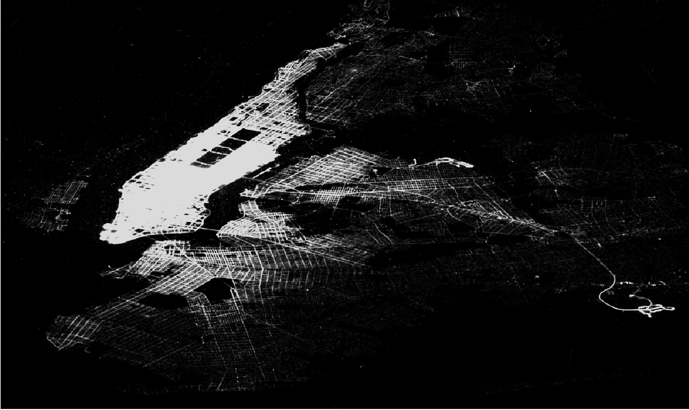

## New York City Yellow Cab

### What can we learn from 45 GB of New York City yellow cab data?
The purpose of this analysis is to explore the yellow cab taxi data set to see what we can learn about the business and to look for taxi cab drivers that cheats their customers by taking them on a sub-optimal route to their destination.

##Table of Contents
1.  [Dataset](#dataset)
2.  

## Dataset
All New York City yellow cab taix data for this analysis was downloaded from [Archive.org](https://archive.org/details/nycTaxiTripData2013), which is for the year 2013. It a data set that comes with vehicle medallion and driver hack license.

Data from 2009 to 2015 can be downloaded from the [NYC Taxi & Limousine Commission](http://www.nyc.gov/html/tlc/html/about/trip_record_data.shtml), however it does not include the vehicle medallion or driver hack license information.

## Data Pre-Processing
The taxi trip and fare data needed to be merged for analysis, a program was writen to see if the pickup time data ordering is the same in both datasets. If the data ordering in both datasets is the same then a Pandas concat function can be used to merge the large datasets together. 
* This is the code to check the ordering between the trip and fair data
* The trip and fair data match, therefore the follow code can be used to merge the two together
The last step in processing the data is to remove outliers in data set and subset it by month. Outliers were found in the following columns of the dataset: pickup and drop-off latitude and longitude, passenger count, trip time, and trip distance. 
* The code for cleaning and subseting the data can be found here

## Taxi Trip Destination Analysis

