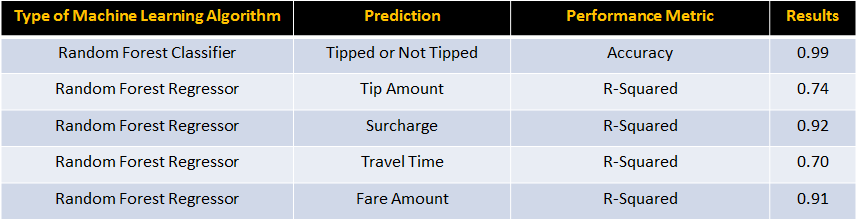

## New York City Yellow Cab

### What can we learn from 45 GB of New York City yellow cab data?
The purpose of this analysis is to explore the yellow cab taxi data set to see what we can learn about the business and to look for taxi cab drivers that cheats their customers by taking them on a sub-optimal route to their destination.

##Table of Contents
1.  [Dataset](#dataset)
2.  [Data Pre-Processing](#data-pre-processing)
3.  [Taxi Trip Destination Analysis](#taxi-trip-destination-analysis)
4.  [Taxi Trip Tips Analysis](#taxi-trip-tips-analysis)
  * [Tips Above 10 Dollars](#tips-above-10-dollars)
5.  [Average Trip Speed](#average-trip-speed)

## Dataset
All New York City yellow cab taix data for this analysis was downloaded from [Archive.org](https://archive.org/details/nycTaxiTripData2013), which is for the year 2013. It a data set that comes with vehicle medallion and driver hack license.

Data from 2009 to 2015 can be downloaded from the [NYC Taxi & Limousine Commission](http://www.nyc.gov/html/tlc/html/about/trip_record_data.shtml), however it does not include the vehicle medallion or driver hack license information.

## Data Pre-Processing
The taxi trip and fare data needed to be merged for analysis, a program was writen to see if the pickup time data ordering is the same in both datasets. If the data ordering in both datasets is the same then a Pandas concat function can be used to merge the large datasets together. 
  * This is the code to check the ordering between the trip and fair data
  * The trip and fair data match, therefore the follow code can be used to merge the two together

The last step in processing the data is to remove outliers in data set and subset it by month. Outliers were found in the following columns of the dataset: pickup and drop-off latitude and longitude, passenger count, trip time, and trip distance. 
  * The code for cleaning and subseting the data can be found here

## Taxi Trip Destination Analysis

The image above is a plot of 17 million destination of a New York City cab in the month of January 2013. The plot creates a map of New York City by taxi cab drop off latitude and longitude. In the plot, the bright areas are popular taxi drop-off locations, such as, airports and Manhattan.     
  * The code for this plot can be found here

## Taxi Trip Tips Analysis

<b>Figure 1: </b> Tips 20% and greater pickup locations

<b>Figure 2: </b> Tips 20% and greater drop off locations 

Figures 1 and 2 above reveals pickup and drop off locations for tip greater than equal to 20%. It is easy to see that in figure1 that the best pickup location for high tips are Manhattan and airports. Figure 2 show that they are headed all over Manhattan, the airports, and places closest to Manhattan.
  * The code for this figure can be found here

### Tips Above 10 Dollars

The plot above shows pickup (blue) and drop-off (red), where tip above ten dollars are received. From the plot it is easy to see that the best pickup locations are airports and subway stations. Most of the passengers are headed either to Times Square or the airports.
  * The code for this plot is found here

## Average Trip Speed

This plot shows average trip speed in three ranges: less than equal to 25 MPH (blue), greater than 25 MPH and less than equal to 45 MPH (yellow), and greater than 45 MHP (red).

Below is a timelaps video of average taxi cab trip speed by pickup hour of day. You can see that trip speed increases and decrease throughout the day in Manhattan. 

## Predictive Analysis
There were five predictive analysis completed on the New York City Taxi data on the following features: tipped or not tipped, tip amount, surcharge, travel time, and fare amount. 

### Tipped or Not Tipped Feature Importance

### Tip Amount Feature Importance

### Surcharge Feature Importance

### Travel Time Feature Importance

### Fare Amount Feature Importance

## Finding Bad Cab Drivers

